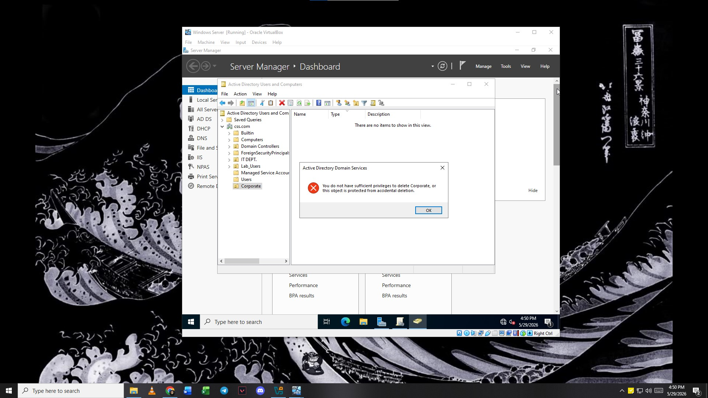
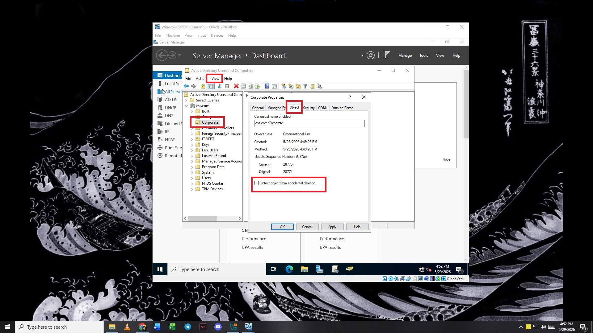

# Common Troubleshooting
## 1. Building the OU Hierarchy
### Problem: You get an "Access Denied" error when trying to delete or move an OU.
### Cause: The "Protect container from accidental deletion" safety checkbox is turned on for that OU.
### Solution: In Active Directory Users and Computers, click View at the top menu -> check Advanced Features. Now, right-click your OU -> Properties -> go to the Object tab -> uncheck Protect container from accidental deletion -> click Apply.
### Evidence:
<table>
  <tr>
    <td></td>
    <td></td>
  </tr>
</table>

### 💡 Lesson Learned: Account lockouts are rarely a user forgetting their password; they are usually caused by cached credentials. When a user updates their desktop password, their smartphone or tablet still tries to connect to corporate Wi-Fi or email using the old password, triggering an automatic lockout.
#### *Pro Tip: Always ask the user to turn off Wi-Fi on their phone for 5 minutes right after a password change to let the systems sync up cleanly.*

## 2. User Onboarding & Passwords
### Problem: Windows blocks you from creating a user, displaying a "Password does not meet requirements" error.
### Cause: The temporary password you entered is too simple and violates the default domain password complexity rules.
### Solution: Type a stronger temporary password using a mix of uppercase letters, lowercase letters, numbers, and symbols (e.g., P@ssword123!).
### 💡 Lesson Learned: Never assign permissions directly to an individual user account. Always practice AGDLP (Accounts inside Global groups, which go into Domain Local groups, which are assigned Permissions). If an employee changes roles or leaves, you only have to change their group membership, rather than hunting down every single folder they had access to manually.

## 3. Validate Account Control / Client Login
### Problem: The client machine displays the error: "The trust relationship between this workstation and the primary domain failed" during login.
### Cause: The client computer object was accidentally deleted from AD, or its machine account password fell out of sync with the Domain Controller.
### Solution: Log into the client machine using its local administrator account. Remove the machine from the domain by joining a temporary Workgroup, restart the computer, and then join it back to the css.com domain.

### Problem: The client machine displays an "An error occurred during logon: The network path was not found" or "Domain not available" error.
### Cause: The client VM cannot find the Domain Controller because its DNS settings are pointing to the internet (or VirtualBox DHCP) instead of your Server's IP address.
### Solution: Open network adapter settings on the client VM. Open IPv4 Properties and manually change the Preferred DNS Server to match the exact static IP address of your Windows Server. Run ipconfig /flushdns in the command prompt.

### 💡 Lesson Learned: DNS is the root cause of 90% of Active Directory errors. When a computer loses its trust relationship or fails to pull a Group Policy, it is almost always because the computer's network adapter stopped looking at the internal Domain Controller for DNS and switched to a public one (like Google's 8.8.8.8).

#### *Pro Tip: Always check ipconfig /all first to make sure the client is talking exclusively to your lab's DNS server.*
