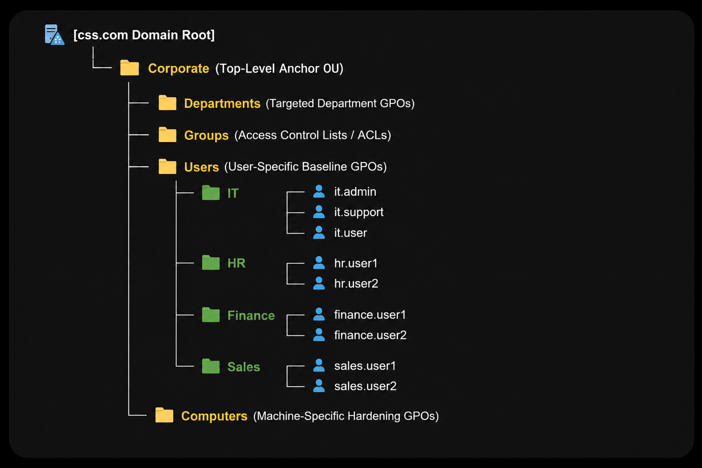

# Why This Setup Matters? Makes the documentation cleaner and shows deeper understanding.
---
## 1. The Multi-Tier OU Hierarchy (Organizing the Lab)
### Think of an Organizational Unit (OU) as a folder inside your domain. Instead of throwing all your users, groups, and computers into one messy pile, nesting them under a Corporate anchor folder creates a clean structure.

### - By keeping your computers and users in separate folders, you can apply rules (like a custom desktop wallpaper) to employees' screens without accidentally breaking your Domain Controllers or servers.

### - Keeping the safety checkbox turned on locks the folder. If you accidentally click and drag a department folder with 500 users into the trash, Active Directory blocks the move and saves your network from crashing.

### - This setup allows you to safely give your Helpdesk team access to reset passwords in the Users folder without giving them power over the rest of the network.
---
## 2. User Onboarding & Least Privilege (Security First)
### Creating accounts correctly directly impacts network security and tracking.

### - New accounts are automatically placed in the Domain Users group, which has zero administrative power. Users only get access to the folders and tools they absolutely need to do their job, preventing malware from easily spreading.

### - Forcing a user to change their temporary password on their first login ensures that only the employee knows their password. If a breach happens, the user cannot claim an IT admin logged into their account, ensuring complete accountability.

## 3. Session Validation (Testing the Infrastructure)
### Logging in from a client computer isn't just about verifying a password; it acts as a full health check for your lab infrastructure.

### - Active Directory cannot run without proper networking. A successful login proves that your VirtualBox private network, IP addressing, and DNS server records are talking to each other perfectly.

### - Verifying that a standard user account works proves that the client machine correctly restricts normal users from disabling firewalls, altering IP settings, or installing malicious software.
