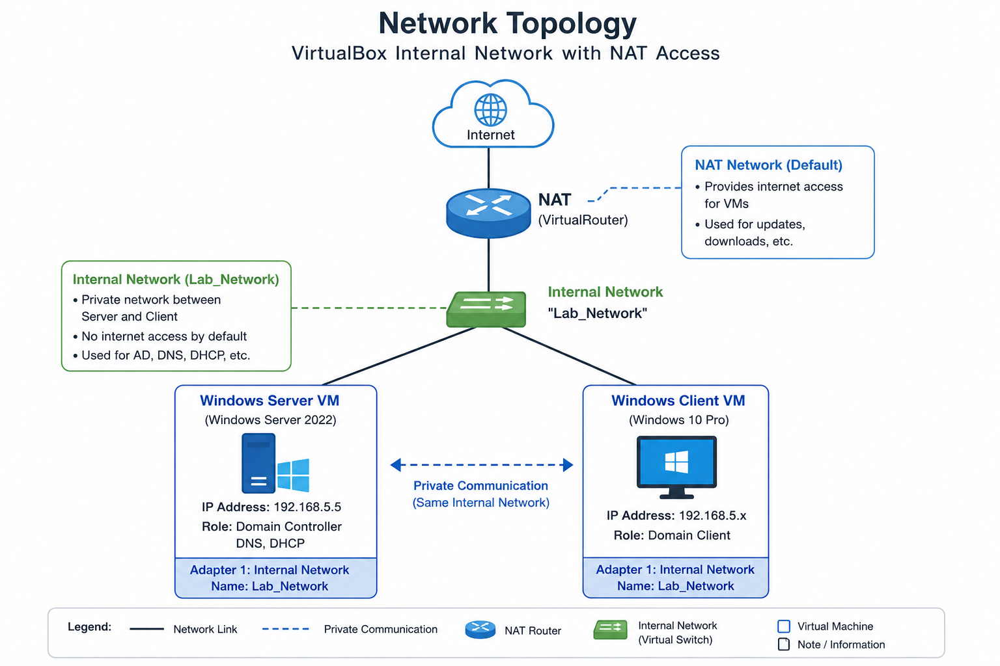

# Lab Module: VirtualBox Private Network Configuration
### This module establishes the foundational network infrastructure for an Active Directory home lab using Oracle VirtualBox. By connecting a Windows Server 2022 instance (DC, DNS, and DHCP server) and a Windows 10 Pro Client via an isolated internal network switch named Lab_Network, the environment safely simulates a real-world enterprise network. A secondary NAT configuration is included to provide internet access without disrupting the private lab environment.

## Tools & Technologies
### Hypervisor & Network Isolation: Oracle VirtualBox & Internal Network Configuration (Lab_Network).

### Operating Systems: Windows Server 2022 & Windows 10 Pro Workstation.

### Core Frameworks: TCP/IP Networking & Virtual Machine Administration.

## Deliverables & Downstream Use Cases
### The repository provides a Procedure Checklist, a Network Flowchart, and a Virtual Network Topology diagram to serve as the structural baseline for five subsequent lab phases:

### Active Directory Deployment

### DNS & DHCP Configuration

### Client Domain Joining

### Group Policy Management

### Shared Folders & Permissions Allocation

---

# VirtualBox Private Network Topology

