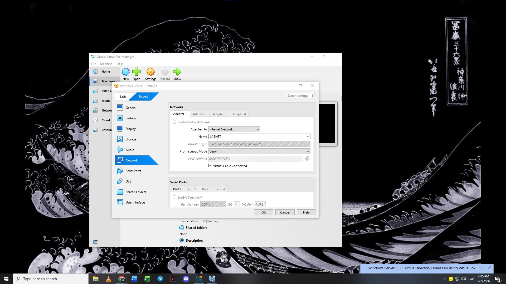
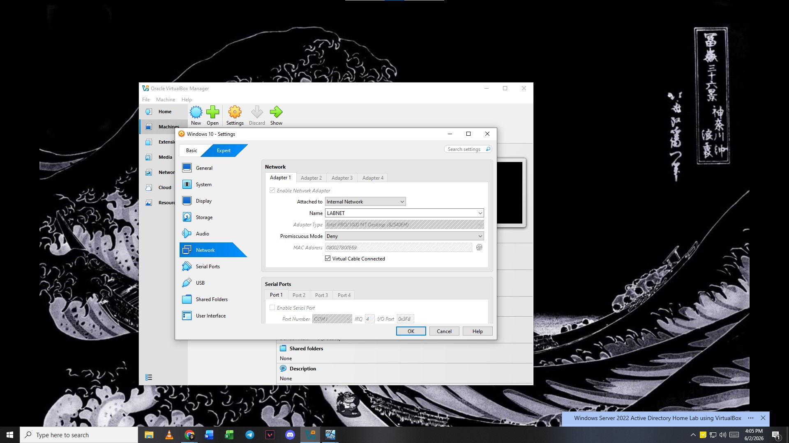

# Why This Setup Matters
### Setting up your virtual network correctly isn't just about making the lab work—it prevents real-world network failures and builds the habits of a professional systems administrator.
---

## 1. Switching to an Internal Network disconnects your lab from your actual home network. If you don't do this, your lab's server will start handing out rogue IP addresses to your home router, knocking your real-world Wi-Fi, phone, and family devices completely offline.

## 2. Creating a Virtual Switch: Giving both VMs the exact same network name (LABNET) tells VirtualBox to plug them into the same invisible network switch. If you make a typo on one machine (like LAB_NET), they won't be plugged into the same switch and can't talk to each other.
---
# Server
 

# Client
 
