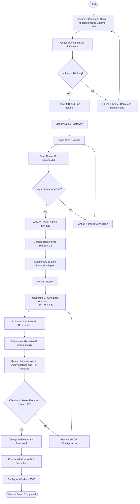

```mermaid
flowchart TD

A([Start]) --> B[Connect Client and Server to Router using Ethernet Cable]

B --> C[Check WAN and LAN Indicators]
C --> D{Indicators Blinking?}

D -- Yes --> E[Open CMD and Run ipconfig]
D -- No --> F[Check Ethernet Cable and Router Ports]
F --> B

E --> G[Identify Default Gateway]
G --> H[Open Web Browser]
H --> I[Enter Router IP: 192.168.1.1]
I --> J{Login Prompt Appears?}

J -- Yes --> K[Access Router Admin Interface]
J -- No --> L[Check Network Connection]
L --> H

K --> M[Change Router IP to 192.168.1.5]
M --> N[Disable and Enable Network Adapter]
N --> O[Restart Router]

O --> P[Configure DHCP Range<br/>192.168.1.1 - 192.168.1.254]

P --> Q[In Server Set Static IP Reservation]
Q --> R[Client must Received IP Automatically]

R --> S[Restart both Network to Apply Settings and Run ipconfig]
S --> T{Client and Server Received Correct IP?}

T -- Yes --> U[Change Default Admin Password]
T -- No --> V[Review DHCP Configuration]
V --> P

U --> W[Enable WPA3 or WPA2 Encryption]
W --> X[Configure Wireless SSID]

X --> Y([Network Setup Completed])
```
